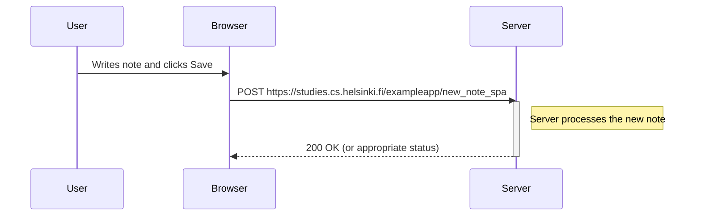

# 0.6

```mermaid
sequenceDiagram
    participant User
    participant Browser
    participant Server

    User->>Browser: Writes note and clicks Save
    Browser->>Server: POST https://studies.cs.helsinki.fi/exampleapp/new_note_spa
    activate Server
    Note right of Server: Server processes the new note
    Server-->>Browser: 200 OK (or appropriate status)
    deactivate Server
```
